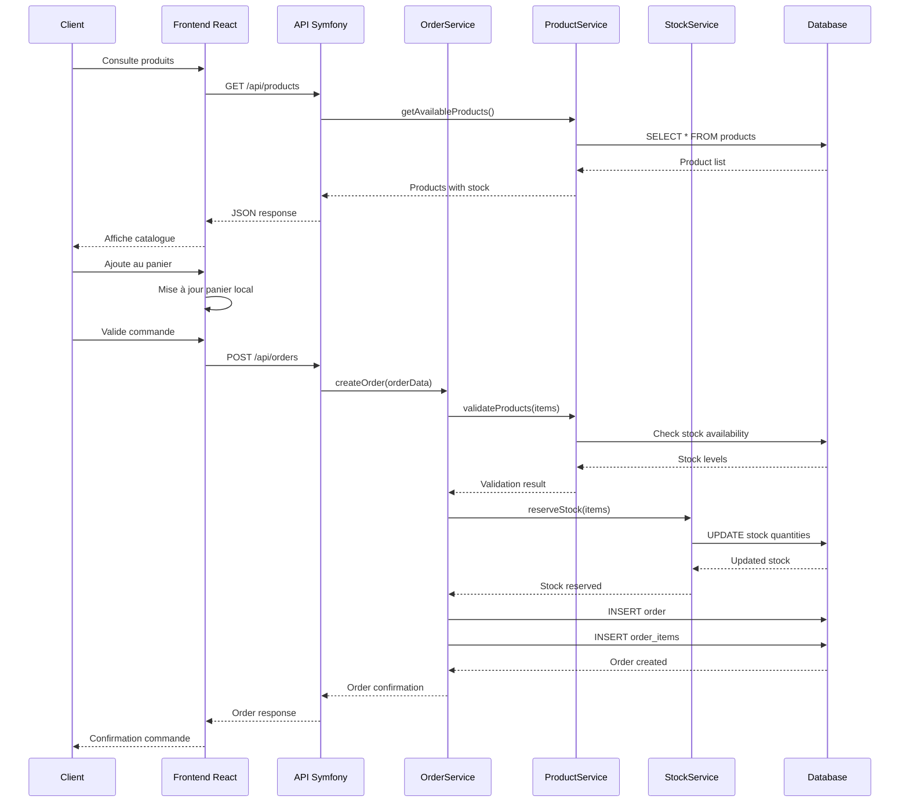
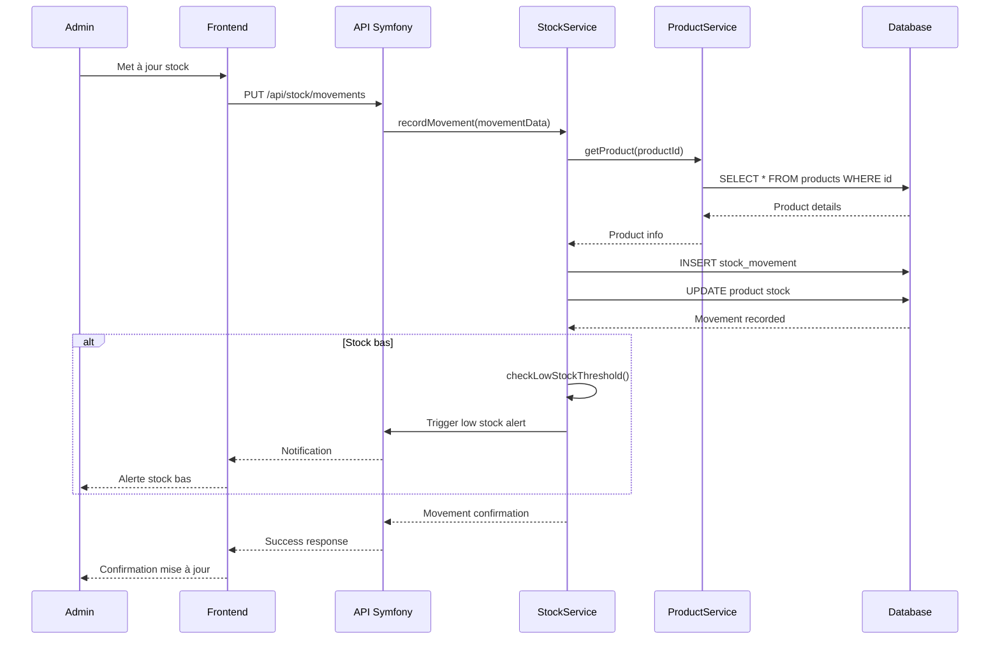
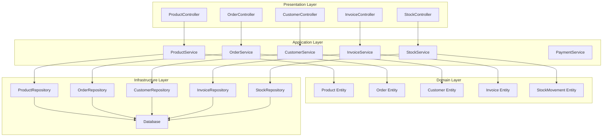

# Diagrammes UML - Mini ERP

## 1. Diagramme des Cas d'Utilisation (Use Case Diagram)

```mermaid
graph TD
    A[Admin] --> B[Gestion des Produits]
    A --> C[Gestion des Stocks]
    A --> D[Gestion des Clients]
    A --> E[Gestion des Commandes]
    A --> F[Gestion des Factures]
    A --> G[Gestion des Utilisateurs]
    A --> H[Rapports et Statistiques]
    
    I[Vendeur] --> B
    I --> C
    I --> D
    I --> E
    I --> F
    I --> H
    
    J[Client] --> K[Consulter les Produits]
    J --> L[Passer Commande]
    J --> M[Suivre Commande]
    J --> N[Voir Factures]
    J --> O[Gérer Compte]
    
    P[System] --> Q[Authentification]
    P --> R[Gestion des Paiements]
    P --> S[Notifications]
    P --> T[Export de Données]
```



## 2. Diagramme de Classes (Class Diagram)

```mermaid
classDiagram
    class User {
        +int id
        +string email
        +string password
        +string firstName
        +string lastName
        +Role role
        +datetime createdAt
        +datetime updatedAt
        +authenticate()
        +hasPermission()
    }
    
    class Role {
        +int id
        +string name
        +string description
        +json permissions
    }
    
    class Customer {
        +int id
        +string email
        +string firstName
        +string lastName
        +string phone
        +string address
        +datetime createdAt
        +getOrders()
        +getTotalSpent()
    }
    
    class Product {
        +int id
        +string name
        +string description
        +decimal price
        +string sku
        +int stockQuantity
        +Category category
        +boolean isActive
        +updateStock()
        +isAvailable()
    }
    
    class Category {
        +int id
        +string name
        +string description
        +Category parent
        +getProducts()
    }
    
    class Order {
        +int id
        +Customer customer
        +OrderStatus status
        +datetime orderDate
        +decimal totalAmount
        +string shippingAddress
        +addItem()
        +calculateTotal()
        +updateStatus()
    }
    
    class OrderItem {
        +int id
        +Order order
        +Product product
        +int quantity
        +decimal unitPrice
        +decimal totalPrice
    }
    
    class Invoice {
        +int id
        +Order order
        +string invoiceNumber
        +datetime issueDate
        +datetime dueDate
        +decimal totalAmount
        +InvoiceStatus status
        +generatePDF()
        +calculateTaxes()
    }
    
    class Payment {
        +int id
        +Invoice invoice
        +decimal amount
        +PaymentMethod method
        +PaymentStatus status
        +datetime paymentDate
        +string transactionId
        +processPayment()
        +refund()
    }
    
    class StockMovement {
        +int id
        +Product product
        +MovementType type
        +int quantity
        +string reason
        +datetime movementDate
        +User user
    }
    
    class OrderStatus {
        <<enumeration>>
        PENDING
        CONFIRMED
        PROCESSING
        SHIPPED
        DELIVERED
        CANCELLED
    }
    
    class PaymentStatus {
        <<enumeration>>
        PENDING
        COMPLETED
        FAILED
        REFUNDED
    }
    
    class MovementType {
        <<enumeration>>
        IN
        OUT
        ADJUSTMENT
    }
    
    User ||--o{ Role : has
    Customer ||--o{ Order : places
    Order ||--o{ OrderItem : contains
    Order ||--|| Invoice : generates
    Invoice ||--o{ Payment : receives
    Product ||--o{ OrderItem : ordered_in
    Product ||--o{ StockMovement : tracked_in
    Product }|--|| Category : belongs_to
    Category ||--o{ Category : parent_child
    User ||--o{ StockMovement : performs
```

## 3. Diagramme de Séquence - Processus de Commande



## 4. Diagramme de Séquence - Gestion des Stocks



## 5. Diagramme de Composants - Architecture Symfony


